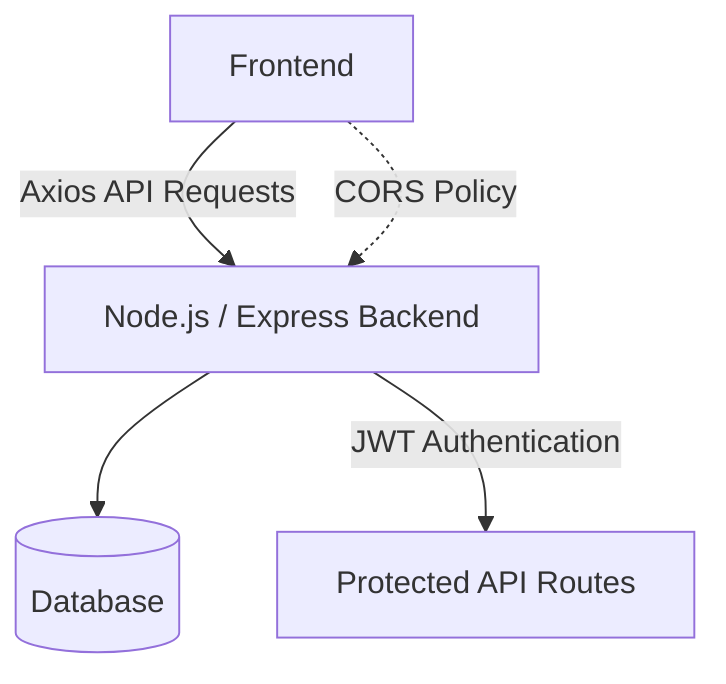
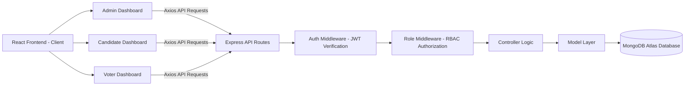
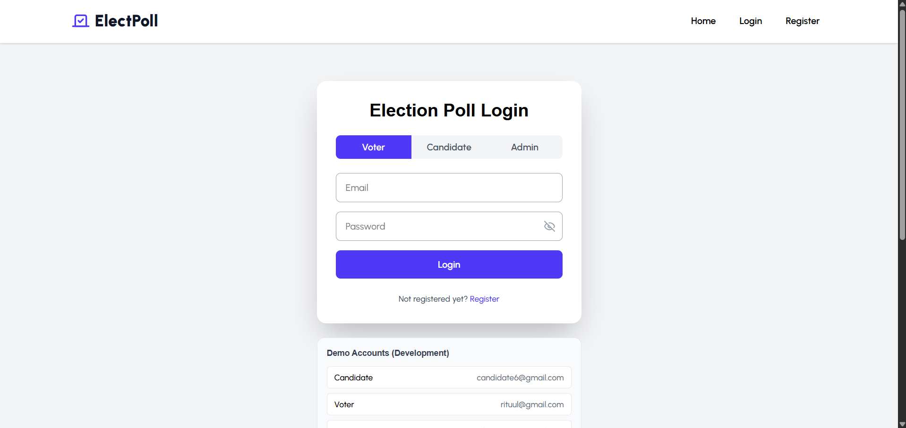
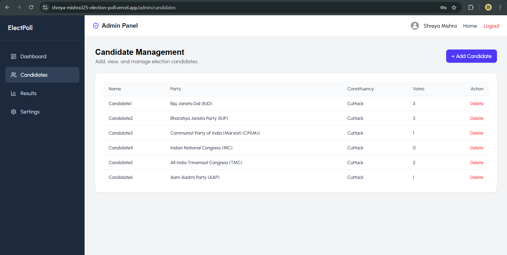
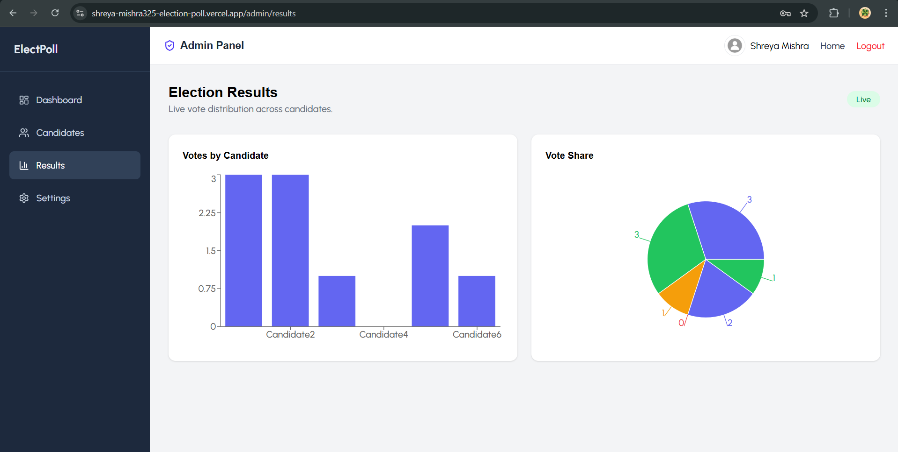
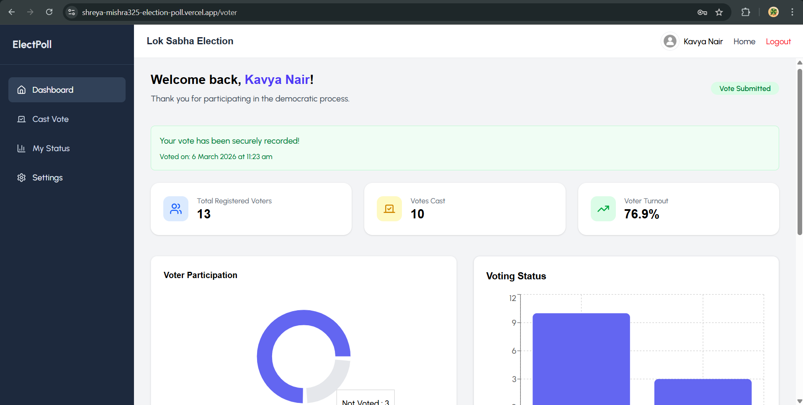

# 🗳️ Election Poll System  

A **full-stack SaaS-style web application** that enables secure online elections with **role-based access control (RBAC)**.  
Built using **React (frontend)** and **Node.js/Express + MongoDB (backend)**.

The platform provides **role-based dashboards, secure voting, real-time analytics, and modern UI/UX**.

---

## 🌐 Deployment  

- **Backend deployed on:**  https://election-poll-2gdn.onrender.com  
- **Frontend deployed on:**  https://shreya-mishra325-election-poll.vercel.app  

Application communication flow:

## 🧭 System Architecture

---

# 🚀 Features  
- Clean and feature-based modular folder structure for scalability and maintainability.
## 👤 Authentication & Roles  

Secure authentication using **JWT tokens** and **role-based access control (RBAC)**.

Supported roles:

### Admin
- Manage candidates
- Monitor voter participation
- View election statistics and analytics
- Manage candidate credentials

### Candidate
- View personal vote count
- View current rank among candidates
- Analyze vote share and voter participation

### Voter
- Cast vote securely
- Vote only once
- Receive confirmation after voting

---

## 🗳️ Voting System  

- Secure **single-vote mechanism**
- Dynamic candidate list fetched from backend
- Duplicate voting prevention
- Confirmation message after voting
- Server-side validation for vote integrity

---

## 📊 Results & Analytics  

### Candidate Dashboard
- View personal vote count
- View candidate rank
- Analyze vote share using charts
- View voter participation metrics

### Voter Dashboard
- View available candidates
- Cast a vote securely
- Receive voting confirmation
- View voting status

### Admin Dashboard
- View vote counts of all candidates
- Monitor election statistics
- Real-time election analytics

---

## 📡 Real-Time Updates  

The system supports **real-time analytics updates using WebSockets**, enabling dynamic dashboard updates without page refresh.

---

## 🎨 Frontend (React + SaaS-style UI)

Modern frontend built with **React and TailwindCSS** featuring a **SaaS-style dashboard interface**.

Features:

- Responsive design
- Role-based dashboards
- Skeleton loading states
- Interactive charts and analytics
- Smooth UI animations using **Framer Motion**
- Interactive UI components using **Swiper.js**
- Custom toast notifications
- Demo login credentials for testing

---

## 🔧 Backend (Node.js, Express, MongoDB)

Backend built using **Node.js and Express** following RESTful architecture.

Capabilities:

- Authentication APIs
- Voting APIs
- Candidate management APIs
- Analytics APIs
- Role-based middleware protection
- MongoDB Atlas data persistence

---

## 🔒 Security

The system includes multiple security layers:
- Password hashing using **bcrypt**
- **JWT-based authentication**
- **Protected API routes**
- **Role-based access control (RBAC)**
- Duplicate vote prevention
- Secure CORS configuration
- Environment variable protection

Voting confirmation message:

*“Your vote has been recorded securely.”*

---

# 🏗️ Tech Stack  

### Frontend
- React
- TailwindCSS
- React Router
- Axios
- Recharts
- Swiper.js
- Framer Motion
- React Hot Toast
- lucide-react

### Backend
- Node.js
- Express.js
- MongoDB Atlas
- JWT Authentication
- bcrypt
- WebSockets

### Deployment
- **Frontend:** Vercel  
- **Backend:** Render

---

## 🧪 Demo Accounts  

The login page includes demo accounts for testing different roles.
Available roles:

- Admin
- Candidate
- Voter

Users can click a demo account to automatically fill login credentials.

---

## 📸 Screenshots

| Login Page | Admin Dashboard |
|------------|----------------|
|  |  |

| Candidate Analytics | Voting Page |
|---------------------|-------------|
|  |  |

---

## 🔮 Future Plans

- OTP-based **phone verification for voters**
- **Facial recognition authentication** for secure voting
- Multi-election/event support
- JWT refresh tokens for improved authentication security
- Email notifications after successful voting
- Election scheduling system
- Advanced analytics dashboards
- Further UI/UX enhancements and accessibility improvements

---

# ⭐ Project Highlights

This project demonstrates:

- Full-stack web development
- Secure authentication systems
- Role-based architecture (RBAC)
- Real-time analytics dashboards
- Modern SaaS-style UI
- Production-ready architecture
- Designed to scale for multi-election systems